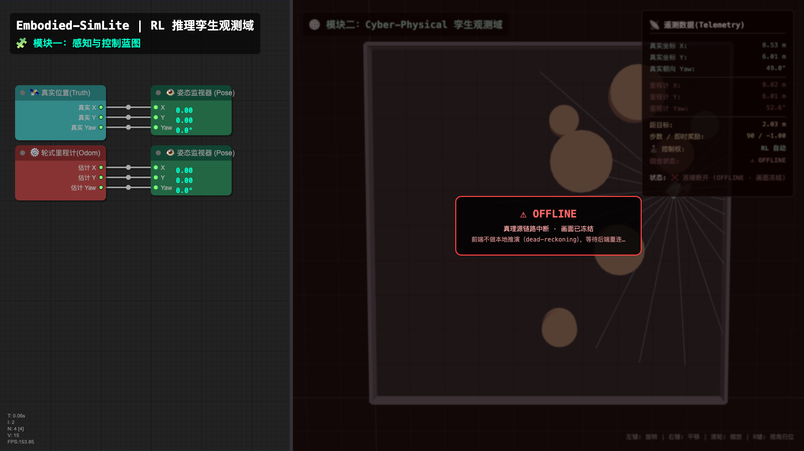
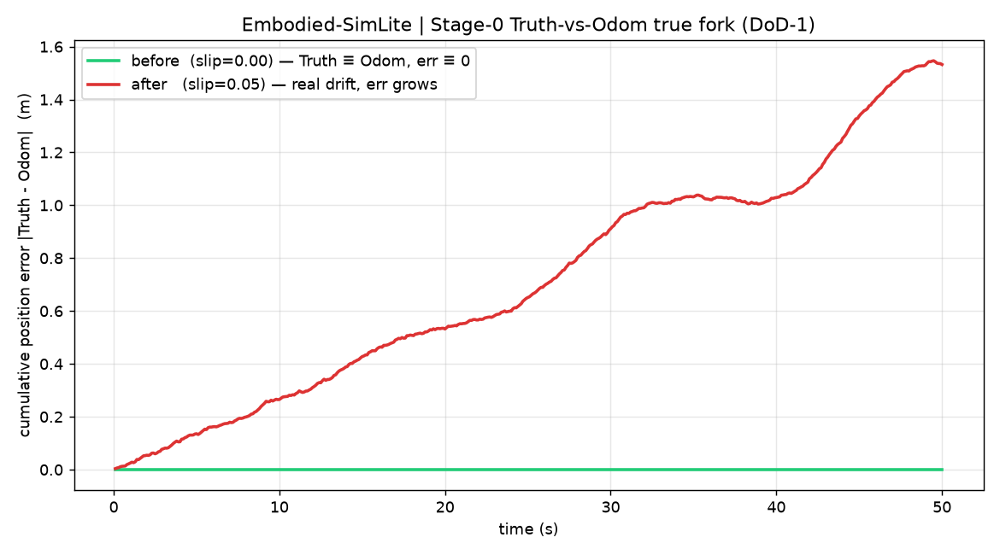
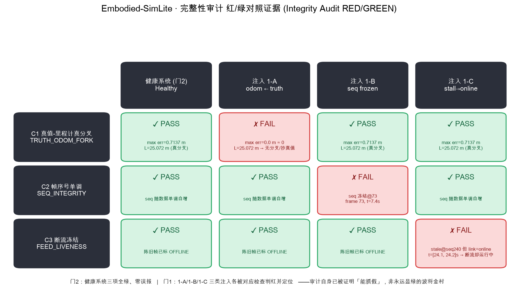
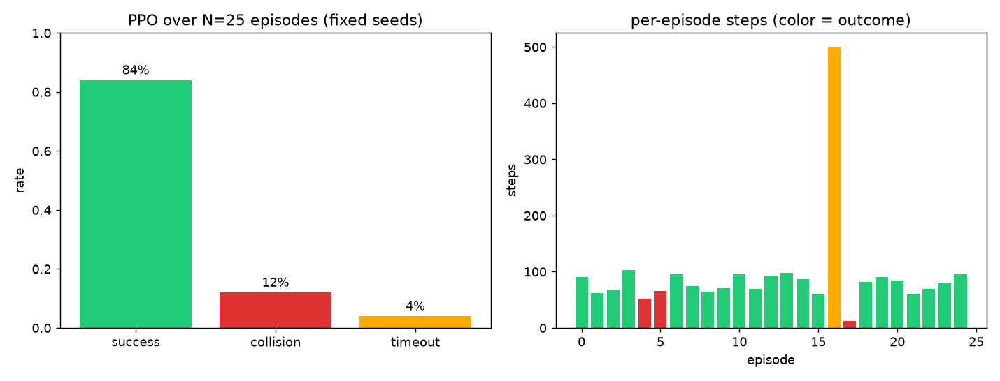
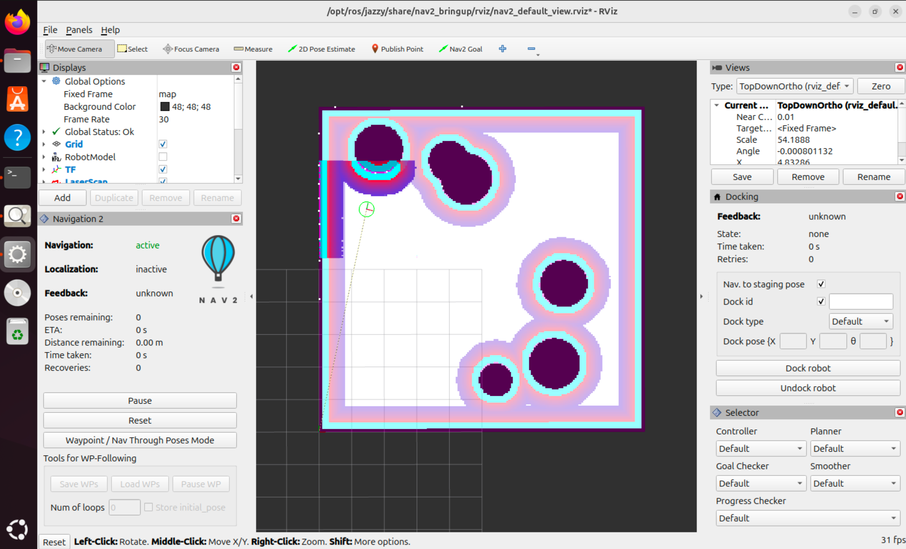
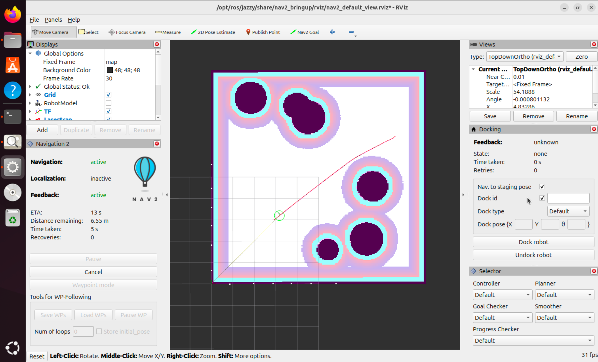

> 📌 **论文工件快照**：tag `paper87-artifacts`（工件提交 `63da6e7`）· 基准 `artifacts/benchmark/benchmark_v1_frozen.csv` SHA-256 `101477654d98d4d88ba50dc4b73873ca635bb7baff13bb7ae6c69bf4c0ac2d8e` · 路径 `artifacts/`
> 📌 **Paper-87 artifact snapshot**: tag `paper87-artifacts` (artifacts commit `63da6e7`) · benchmark SHA-256 `101477654d98d4d88ba50dc4b73873ca635bb7baff13bb7ae6c69bf4c0ac2d8e` · path `artifacts/`
> 📌 **Paper-2 平台快照**：tag `paper2-final`（commit `4f111ad`，独立分支 `paper2-embodied-simlite`，冻结、不并入 master）
> 📌 **Paper-2 platform snapshot**: tag `paper2-final` (commit `4f111ad`, standalone branch `paper2-embodied-simlite`, frozen, never merged into master)

# Embodied-SimLite

> **轻量化具身智能数字孪生「验证」平台** —— 面向具身智能教学中的**系统审计素养**培养。
>
> 不追求"在完美仿真里跑通算法"，而是教学生区分「**看起来对**」与「**被证明对**」：用一套可被审计的数字孪生，量化感知误差、检测系统自欺。纯 Python + 浏览器即可运行，无需 Gazebo 等重型物理引擎。

---

## 1. 平台简介

Embodied-SimLite 是一个轻量化的具身智能（自主导航/避障）数字孪生平台，设计哲学是**彻底解耦物理推演、AI 决策与孪生渲染**，并坚持一条架构铁律：

> **后端是唯一真理源（single source of truth），前端是纯观测视窗。** 前端永不本地推演位姿；后端断流时，前端冻结画面并显式标 OFFLINE，绝不用本地积分"续算"假装在线。

在此地基上，平台提供一组**可被审计**的能力：真分叉里程计（让"误差"是真的）、防自欺完整性审计（让"审计"自己先被证明能抓假）、强化学习评测，以及 ROS 2 桥接。它面向教学：让学生对 Sim-to-Real gap 有量化认知、对"看似工作"的黑盒系统具备反证伪能力。

---

## 2. 核心功能模块

### 2.1 后端唯一真理源 + 前端纯观测架构
- **后端**（`inference_server.py` + `embodied_env.py`）：纯 numpy 物理内核（差速底盘运动学 + 解析式 LiDAR + O(1) 碰撞检测），由 FastAPI 以 ~60Hz 异步心跳驱动，承载 PPO 策略推理，是唯一真理源。
- **前端**（内联于 `inference_server.py` 的 Three.js + litegraph）：仅渲染后端经 WebSocket 下发的状态，**不承担任何物理计算**。
- **断流即冻结 + OFFLINE**：WS 断开时前端冻结画面并弹出 OFFLINE 遮罩（不做 dead-reckoning）。

  

### 2.2 真分叉里程计（true-fork odometry）
- `embodied_env._integrate_odom()` 在真值位姿之外，**独立积分一条带"真打滑漂移"的里程计**：对轮速施加乘性偏差 + 比例噪声（噪声取自带种子 RNG，可复现，非 hardcode）。
- **真值 Truth 保持无噪声基准**；里程计 Odom 随行程**单调偏离真值**——累积误差真实非零（开环 500 步实测 ATE_RMSE ≈ **0.83 m**）。
- 打滑系数可配置，`slip=0` 时里程计逐位退化为 `odom ≡ truth`，作为对照。

  

### 2.3 防自欺完整性审计（anti-self-deception integrity audit）
平台最核心的教学卖点：**审计仪自身必须先被证明"能抓假"**——一个永远显绿的审计就是它自己最反对的"波将金村"。`audit/integrity_audit.py` 提供三项正交检查：

| 检查 | 抓什么自欺 |
|---|---|
| **C1 真值-里程计真分叉 / TRUTH_ODOM_FORK** | 里程计被接回真值（误差链路死掉，`Truth≡Odom`） |
| **C2 帧序号单调 / SEQ_INTEGRITY** | 数据在更新、帧序号却冻结/倒退（帧序号撒谎） |
| **C3 断流冻结 / FEED_LIVENESS** | 断流却仍声明 online / 显示"运行中" |

通过 `audit/fault_injection.py` 向健康系统**真实注入**三类假仪表，审计逐一**判红并定位**（帧号/seq/误差/recv_t）；健康系统则**全绿不误报**。下图为"红/绿对照"证据：第一列健康全绿，后三列每类注入被对应检查判红。

  

### 2.4 强化学习（PPO）评测
`audit/run_action1.py` 用配套 PPO 权重在 **N=25 张各不相同的随机地图**上评测，输出成功率/碰撞率/超时率/平均到达步数，确定性可复现：

- 地图：10 m × 10 m 方形竞技场，四面墙；每回合随机生成 6 个圆形障碍（半径 0.4–0.9 m）。
- 任务：每回合随机起点 + 随机目标（强制相距 > 5.66 m，排除"一步到位"）；随机初始朝向。
- 传感/动作：24 线 360° LiDAR（量程 5 m）；连续动作 `[v, w]`，10 Hz 决策，纯运动学。
- **实测结果**：成功率 **84%** / 碰撞率 **12%** / 超时率 **4%**（N=25，种子 100–124）；平均到达 ~81 步。

  

> 说明：本评测只提供"真实可复现的基础指标"，不追求高性能、不调参、不做新旧基线对比。指标如实呈现。

### 2.5 ROS 2 桥接（需 Ubuntu + ROS 2 环境）
`ros_bridge.py` 做纯协议翻译：把孪生状态翻为 ROS 2 话题 `/odom`（发布**漂移里程计**，与真分叉一致）、`/scan`、`tf`；把 `/cmd_vel` 翻为对推理网关的人工覆盖指令（2 秒窗口内抢占 PPO，实现虚实控制权切换）。

> ⚠️ **ROS 2 桥接需在 Ubuntu + ROS 2（rclpy）环境中运行与验证**；其 `/scan`+`/odom`+`tf` 可作为上层 SLAM/Nav2 的数据源，但本仓库未对 rviz2/Nav2 端到端闭环做自动化验证，请在你的 ROS 2 环境中自行联调（推荐验证路径与逐级判据见第 5 节）。

---

## 3. 环境依赖与安装

**平台核心（Python 部分）**，实测 Python 3.13（3.10+ 应兼容）：

```bash
git clone https://gitee.com/yfeng620/embodied-sim-lite.git
cd embodied-sim-lite
pip install -r requirements.txt      # numpy / gymnasium / torch / stable-baselines3 / fastapi / uvicorn / websockets / matplotlib
```

**ROS 2 桥接（可选，需 Ubuntu + ROS 2）**：`rclpy / tf2_ros / geometry_msgs / nav_msgs / sensor_msgs`（随 ROS 2 发行版提供）+ `pip install websocket-client`。

仓库已附带配套预训练权重 `ppo_embodied_agent.pth`（约 53 KB），**无需自行训练即可直接复现推理与评测**。

---

## 4. 各模块运行方式

```bash
# ① 启动平台（系统唯一入口）：60Hz PPO 推理 + 孪生前端
python inference_server.py
#    浏览器打开 http://localhost:8000 ，即见 3D 孪生 + 控制蓝图 + 遥测面板
#    （绿色为真值本体，红色幻影为里程计，随时间可见其漂移脱离——这就是真分叉）
#    论文截图模式：打开 http://localhost:8000/?screenshot=1
#    → 全局字号 ≥16px、遥测面板行距加大、隐藏操作提示、双语标签取中文，供论文插图重截

# ② 跑防自欺审计 + RL 评测（三道门一键实跑）
python audit/run_action1.py
#    → 门1：注入 1-A/1-B/1-C 假仪表，审计逐一判红并定位
#    → 门2：健康系统三项全绿、零误报
#    → 门3：PPO × 25 回合成功率/碰撞率/到达步数 + 出图 audit/eval_metrics.png
#    → 同时导出机器可读汇总 audit/eval_summary.json（n_maps/计数/比例/时间戳/策略标识，
#       供 tools/paper_figures/make_paper_figures.py --eval-json 复现论文图 4）

# ③ 生成"红/绿对照"审计证据图（需先跑过 ②）
python audit/make_audit_figure.py        # → audit/audit_redgreen_matrix.png
#    加 --paper：大字号 300dpi 输出 audit_redgreen_matrix_paper.png（论文图 2）

# ④ 截取真实断流 OFFLINE 画面（headless Chrome；需本机装有 Chrome）
python audit/capture_offline.py          # → audit/offline_screenshot.png

# ⑤ 复现真分叉 before/after 误差曲线
python diagnostics/record_fork.py        # → diagnostics/fork_error_curve.png
#    加 --paper：额外输出大字号中文版 fork_error_curve_paper.png（论文图 3）

# ⑥（可选）从零训练 PPO（产出新的 ppo_embodied_agent.pth）
python train_agent.py

# ⑦（需 ROS 2 环境）启动 ROS 2 桥接节点
python ros_bridge.py                     # 默认连 ws://127.0.0.1:8000/ws
#    跨机：SIM_GATEWAY_WS=ws://<网关IP>:8000/ws python ros_bridge.py
#    端到端闭环（rviz2 / SLAM 建图 / Nav2 导航）的自行验证步骤与判据 → 见第 5 节

# ⑧（需 ROS 2 环境）静态世界导航模式：真值出图 + 导航网关（SLAM/Nav2 实验推荐）
python make_gt_map.py --seed 42          # 真值占据栅格 map_gt.pgm/.yaml（map 帧=世界帧）
python nav_gateway.py --seed 42          # 替代 ① 作真理源：世界恒定 / 10Hz 实时 / 无 PPO 自走
#    动机与完整用法 → 见第 5.9 节；与 ① 勿同时运行（同占 8000 端口）
```

---

## 5. ROS 2 端到端闭环自行验证（SLAM 建图 + Nav2 导航）

> ⚠️ **边界重申**：本仓库的自动化验证只覆盖到 `ros_bridge.py` 本身——在 ROS 2 环境下提供 `/odom`+`/scan`+`tf` 与人工覆盖；**rviz2/Nav2/SLAM 的完整闭环未在本仓库做自动化验证**。本节给出推荐的自行验证路径与逐级判据，供你在自己的 ROS 2 环境中联调。示例以 Ubuntu 22.04 + ROS 2 Humble 为准（Jazzy 同理，差异处已注明）。
>
> 📋 **教学使用**：配套学生实验工作单见 [`docs/ros2_lab_worksheet.md`](docs/ros2_lab_worksheet.md)，含五关任务勾选清单、两个审计观察点、证据截图规范（E1–E8）与实验记录表，可直接打印发放。

### 5.1 验证前：看清桥接契约

| 方向 | 话题 / tf | 消息类型 | 说明 |
|---|---|---|---|
| 发布 | `/odom` | `nav_msgs/Odometry` | **漂移里程计**（非真值，与 2.2 真分叉一致）；位姿＋**有限差分 twist**（相邻帧位姿差分，供依赖速度反馈的控制器/平滑器使用）；frame `odom` → `base_footprint`；随 WS 广播（默认网关≈60 Hz / nav_gateway=10 Hz） |
| 发布 | `/scan` | `sensor_msgs/LaserScan` | 24 线 360°，量程 5 m，frame `laser_frame`；**QoS 为 BEST_EFFORT**；按孪生 step 去重发布 |
| 广播 | tf | — | `odom → base_footprint → base_link`，以及 `base_footprint → laser_frame` |
| 订阅 | `/cmd_vel` | `geometry_msgs/Twist` | 翻译为推理网关的 2 s 人工覆盖指令，抢占 PPO |
| 订阅 | `/cmd_vel_nav` | `geometry_msgs/TwistStamped` | 同上（适配 Jazzy 起 Nav2 默认的 TwistStamped 输出） |

本体运动约束（Nav2 参数必须与之匹配，见 5.7）：差速底盘，半径 **0.20 m**；线速度 **v ∈ [0, 1.0] m/s——不能倒退，负值会被网关截断为 0**；角速度 **|w| ≤ 1.5 rad/s**。桥接以墙钟打时间戳，因此**全链路 `use_sim_time` 一律保持 `false`**。

### 5.2 第 0 步：环境准备

```bash
# ROS 2 侧（Ubuntu，以 Humble 为例；Jazzy 把包名前缀换成 ros-jazzy-）
sudo apt install ros-humble-slam-toolbox ros-humble-navigation2 \
                 ros-humble-nav2-bringup ros-humble-teleop-twist-keyboard
pip install websocket-client

# 终端 A（可与 ROS 2 机器不同机）：启动推理网关（唯一真理源）
python inference_server.py

# 终端 B（ROS 2 环境）：启动桥接节点
source /opt/ros/humble/setup.bash
python ros_bridge.py
#   跨机：SIM_GATEWAY_WS=ws://<网关IP>:8000/ws python ros_bridge.py
```

桥接终端打印 `✅ 已成功连接到推理网关！` 即可进入下一关。

### 5.3 第 1 关：话题与 tf 冒烟验证

```bash
ros2 topic list                          # 应包含 /odom /scan
ros2 topic hz /odom                      # 期望 ≈60 Hz
ros2 topic hz /scan                      # 期望稳定高频（按 step 去重后仍应数十 Hz）
ros2 topic echo /scan --once             # ranges 应为 24 个 ≤5.0 的实测距离
ros2 run tf2_ros tf2_echo odom base_footprint   # 位姿应随本体运动持续变化
ros2 run tf2_tools view_frames           # 生成 frames.pdf，核对 tf 树
```

**通过判据**：tf 树为 `odom → base_footprint → {base_link, laser_frame}`；`/odom` 位姿与浏览器孪生中红色幻影（里程计）一致，而非绿色真值。

### 5.4 第 2 关：人工覆盖（虚实控制权切换）

```bash
ros2 run teleop_twist_keyboard teleop_twist_keyboard
```

按 `i`（前进）/`j`/`l`（原地转向），观察浏览器 `http://<网关IP>:8000`：

- 绿色本体应即时响应键盘指令；
- 遥测面板「控制模式」由青色 **RL 自动** 切为红色 **ROS 2 人工覆盖**；
- 停止发令 **2 s** 后自动交还 PPO（回落 RL 自动）；
- 按 `,`（后退）本体不动——负线速度被截断为 0，属设计使然，不是故障。

### 5.5 第 3 关：rviz2 观测

```bash
rviz2
```

- Fixed Frame 设为 `odom`；
- Add → **LaserScan**（topic `/scan`），并把其 **Reliability Policy 改为 Best Effort**（默认 Reliable 与桥接 QoS 不匹配，会一个点也收不到）；
- Add → **Odometry**（`/odom`）与 **TF**。

**通过判据**：24 个激光点大致勾勒出 10 m × 10 m 场地边界与圆形障碍；teleop 驱动时点云与 odom 箭头同步运动。

> 教学观察点：rviz2 中的位姿来自**漂移里程计**，与浏览器孪生中的绿色真值会随行程分叉（开环 500 步 ATE_RMSE ≈ 0.83 m）——下一关 SLAM 的意义正是把这条漂移在线校正回来。

### 5.6 第 4 关：SLAM 建图（slam_toolbox）

```bash
ros2 launch slam_toolbox online_async_launch.py use_sim_time:=false
```

slam_toolbox 默认参数与本桥接完全对齐（`base_frame: base_footprint`、`odom_frame: odom`、`scan_topic: /scan`），无需改动。rviz2 中把 Fixed Frame 切为 `map` 并 Add → Map（`/map`），然后用 teleop 缓速绕场一到两圈（或不发指令，让 PPO 自主漫游），观察占据栅格逐步铺满场地。

**通过判据**：

1. `ros2 topic echo /map --once` 有栅格数据；
2. tf 树新增 `map → odom`，且 `ros2 run tf2_ros tf2_echo map odom` 的变换**非恒等、随行程持续变化**——这正是 SLAM 对里程计真漂移的在线校正量；若恒为单位变换，说明扫描匹配没有生效，闭环存疑；
3. 存图成功：`ros2 run nav2_map_server map_saver_cli -f simlite_map`。

> 预期管理：24 线稀疏 LiDAR 的建图质量有限（墙面锯齿、圆障碍轮廓稀疏）属正常现象；可调低 slam_toolbox 的 `minimum_travel_distance` / `minimum_travel_heading` 提高插帧密度。
>
> ⚠️ **默认网关的回合制边界**：`inference_server.py` 在每回合结束（到达/碰撞/500 步截断）时自动 reset——**障碍物随之重摆**，故障碍在 SLAM 图中只会留下多世界叠影，仅场界墙可稳定成图；且其 60Hz 心跳 × `DT=0.1s` 使物理时间以 **6 倍墙钟速**推进。本关用于观察 `map→odom` 校正机制没有问题；**需要干净、可复现的地图请改用 5.9 静态世界导航模式**。

### 5.7 第 5 关：Nav2 导航闭环

与 slam_toolbox **同时运行**（由 SLAM 在线提供 `map→odom` 与 `/map`，无需 AMCL / map_server）：

```bash
ros2 launch nav2_bringup navigation_launch.py use_sim_time:=false
#   建议复制一份 nav2_params.yaml，按下表修改后经 params_file:=<路径> 传入
```

| 参数 | 建议值 | 原因 |
|---|---|---|
| `robot_radius`（global/local costmap） | `0.20` | 与本体半径一致 |
| 控制器 `max_vel_x` / `max_vel_theta` | `≤1.0` / `≤1.5` | 与 env 上限一致，超出部分会被网关截断 |
| DWB `min_vel_x`（或 RPP `allow_reversing`） | `0.0`（`false`） | **本体不能倒退**，倒车轨迹必然执行失败 |
| `robot_base_frame` | `base_footprint`（默认 `base_link` 亦可） | 桥接发布了 `base_footprint→base_link` 恒等变换，二者等价 |

cmd_vel 通道说明：Humble 的 Nav2 全链默认 `Twist`，桥接经 `/cmd_vel` 接收（velocity_smoother 平滑后的输出）；Jazzy 起默认 `TwistStamped`，桥接经 `/cmd_vel_nav` 接收控制器输出。两条订阅通道已覆盖两代契约，通常无需 remap。

> 🔧 **控制器选择实测注记（Jazzy，2026-08）**：默认 MPPI 在本桥接下实测持续低速爬行（~0.01–0.05 m/s，即使 `/odom` twist 可用），长航段必超时；**建议 FollowPath 换 Regulated Pure Pursuit**（不依赖速度反馈，实测 0.8 m/s 满速、终点误差厘米级）。可用 `make_nav2_params_navmode.py` 一键生成含 RPP 的调优参数。

> ⚠️ 默认网关下，回合 reset 会在导航中途重摆障碍——闭环判据可用于观察链路是否打通，但**导航成功率等量化统计务必改用 5.9 静态世界模式**。

rviz2 中用 **Nav2 Goal（2D Goal Pose）** 在已建出的地图空白区下发目标。**闭环判据（全部满足才算打通）**：

1. 桥接终端滚动打印 `🕹️ [人工覆盖下发]`，浏览器孪生控制模式变红 **ROS 2 人工覆盖**，本体开始沿全局路径移动；
2. 局部代价地图中的圆形障碍由 `/scan` 实时刻画，本体绕障不碰撞；
3. 到达目标，Nav2 报 `Goal succeeded`；停止发令 2 s 后控制模式自动回落 **RL 自动**（控制权归还 PPO）；
4. 全程 `map→odom` 校正量随里程计漂移持续更新（第 4 关的教学观察点在导航中持续成立）。

### 5.8 常见问题排查

| 症状 | 常见原因 | 处理 |
|---|---|---|
| rviz2 里 `/scan` 一个点也没有 | 订阅端 Reliability=Reliable，与桥接 BEST_EFFORT 不匹配 | 把订阅方 Reliability 改为 Best Effort |
| 下发目标后本体不动 / 原地抖动 | 控制器输出了负线速度，被网关截断为 0 | 按 5.7 表禁用倒车（`min_vel_x: 0.0` / `allow_reversing: false`） |
| Nav2 有 `/cmd_vel` 输出但孪生无响应 | 桥接未连上网关，或话题消息类型不匹配 | 核对桥接终端 ✅ 连接与 🕹️ 覆盖日志；`ros2 topic info -v` 核对 Twist/TwistStamped 落在哪条订阅通道 |
| tf 报 extrapolation / 时间戳错误 | 某节点 `use_sim_time=true`，或跨机时钟不同步 | 全链路 `use_sim_time:=false`；跨机部署先做 NTP 对时 |
| DWB 轨迹评分异常、走走停停 | 本桥接 `/odom` 只含位姿、twist 恒为 0，而 DWB 参考速度反馈 | 换 Regulated Pure Pursuit 等不依赖速度反馈的控制器 |
| 地图畸变大、墙面重影 | 24 线稀疏 LiDAR + 里程计真漂移（设计使然）叠加 | 调 slam_toolbox 匹配参数；或以 `EmbodiedNavEnv(slip=0.0)` 关闭漂移做对照（`odom ≡ truth`），分离「漂移」与「稀疏」两个变量 |
| 障碍在图上重影成团 / 每次位置都不同 | 默认网关回合制：每回合 reset 重摆障碍（仅场界墙持久） | 改用 5.9 静态世界模式（`nav_gateway.py`，世界恒定） |
| `ros2 topic hz /odom` 频率越数越高（>10/60Hz 基准且爬升）、TF 抖动、AMCL 粒子云发散 | **多个 ros_bridge 实例并发**（重启时旧实例未死透，双源发布同名话题与 tf） | `pkill -f ros_bridge` 后重起**唯一**实例；长跑前用 hz 校验频率恒定 |
| 控制器输出恒为毫米级速度、车龟速爬行 | 控制器依赖 `/odom` 速度反馈（旧版桥 twist 恒 0），或 MPPI 与本桥接的组合问题（Jazzy 实测） | 升级桥（twist 有限差分已内置）；仍爬行则换 RPP 控制器（见 5.7 注记） |

> 再次强调：以上是**推荐验证路径**，不是本仓库的自动化测试承诺。能否跑通受 ROS 2 发行版、Nav2 版本与参数细节影响；请如实记录你的联调结果——区分「看起来对」与「被证明对」，这本身就是平台要教的东西。

### 5.9 静态世界导航模式（nav_gateway + 真值地图）——SLAM/Nav2 实验推荐

默认入口 `inference_server.py` 是「回合制 RL 演示」语义，与导航实验存在三项结构性错配：
①每回合重摆障碍（地图无法稳定成形）②60Hz 心跳 × `DT=0.1s` = 物理时间 6 倍墙钟速（与 Nav2
墙钟控制错拍）③PPO 常驻自走（与外部控制争抢本体）。需要可复现的建图/导航统计时改用：

```bash
# ① 真值出图（map 帧 = 世界帧；与网关同 seed = 同一世界）
python make_gt_map.py --seed 42 --out .
# ② 静态世界网关（替代 inference_server 作真理源；同占 8000，勿同时跑）
python nav_gateway.py --seed 42
# ③ 桥接照旧（契约不变）
python ros_bridge.py
# ④ Nav2 带真值图起（AMCL 定位；rviz2 初始位姿 = 出图脚本打印的起点真值）
ros2 launch nav2_bringup bringup_launch.py map:=./map_gt.yaml use_sim_time:=false
```

模式差异速览：

| | `inference_server.py`（默认演示） | `nav_gateway.py`（静态导航） |
|---|---|---|
| 世界 | 每回合重摆障碍 | seed 固定，永不 reset |
| 时间 | 60Hz×DT0.1 = 6 倍墙钟速 | 10Hz，sim 时间 == 墙钟 |
| 控制 | PPO 常驻，覆盖仅 2s 窗口 | 无 PPO；无指令 = 停车 |
| 里程计 | 真分叉漂移（教学特性） | 默认 `slip=0`（`--slip` 可开对照） |
| 前端 | Three.js 孪生 | 无（观测面 = rviz2） |

两种模式对应两类用途：演示/审计教学用默认入口；建图/导航量化实验用本模式。SLAM 课目
（5.6）也可在本模式下获得干净地图（世界恒定），并与 `make_gt_map.py` 真值图对照评估建图质量。

**配套工具（本模式实验三件套）**：
- `make_nav2_params_navmode.py`：一键生成调优 Nav2 参数（AMCL 预置位姿/RPP 控制器/禁倒车/收紧目标容差）；
- `nav_stack_truthloc.sh [map] [params]`：**真值定位**导航栈（map→odom 恒等；24 束稀疏扫描下 AMCL 单腿漂移实测 0.2–0.5 m，量化实验建议用本脚本代替 AMCL 定位）；
- `traj_logger.py`：10 Hz 轨迹记录到 CSV（实验报告配图/轨迹分析）。

**预期画面（expected view）**——按 5.9 流程起满导航栈后，你的 rviz 应与下图一致
（真值图+膨胀代价图+航点区域；第二张为下发目标后的实时画面，含全局路径与
Nav2 面板的 ETA/Time taken 运行时钟，可用于对照你的复现是否一致）：






---

## 6. 目录结构

```
embodied-sim-lite/
├── embodied_env.py          # 物理内核（gymnasium 环境）：运动学 + 真分叉里程计 _integrate_odom + 解析 LiDAR + 帧序号 seq
├── inference_server.py      # 唯一入口：FastAPI + 60Hz PPO 推理 + WS 广播 + 内联 Three.js 前端（含 OFFLINE 冻结）
├── ros_bridge.py            # ROS 2 桥接（需 ROS 2 环境）：孪生状态→/odom·/scan·tf；/cmd_vel→人工覆盖
├── nav_gateway.py           # 静态世界导航网关（SLAM/Nav2 实验模式）：seed 固定不 reset、10Hz 实时、无 PPO（见 5.9）
├── make_gt_map.py           # 真值出图：由 seed 布局生成 map_gt.pgm/.yaml（map 帧=世界帧，配合 5.9）
├── make_nav2_params_navmode.py  # 5.9配套：一键生成调优Nav2参数（RPP/预置位姿/禁倒车）
├── nav_stack_truthloc.sh    # 5.9配套：真值定位导航栈（map→odom恒等，替代AMCL做量化实验）
├── traj_logger.py           # 5.9配套：10Hz轨迹记录CSV（报告配图/轨迹分析）
├── train_agent.py           # PPO 训练脚本（超实时，剥离时钟）
├── ppo_embodied_agent.pth   # 配套预训练权重（开箱复现推理/评测）
├── Architecture.md          # 架构说明文档
├── requirements.txt
├── audit/                   # 防自欺完整性审计 + 评测
│   ├── integrity_audit.py   #   审计仪：C1 真值-里程计真分叉 / C2 帧序号单调 / C3 断流冻结（论文 v1.1 术语）
│   ├── fault_injection.py   #   假仪表注入器（自证抓假，仅测试用）
│   ├── run_action1.py       #   三门一键实跑：抓假(红) + 健康(绿) + PPO 评测
│   ├── make_audit_figure.py #   红/绿对照矩阵图
│   ├── capture_offline.py   #   headless Chrome 截真实断流 OFFLINE 画面
│   └── *.png                #   结果图（红绿对照 / 评测 / OFFLINE）
├── diagnostics/             # 真分叉诊断
│   ├── record_fork.py       #   真分叉记录器（before/after 误差曲线）
│   └── fork_error_curve.png
└── docs/
    └── ros2_lab_worksheet.md #  ROS 2 联调与审计·学生实验工作单（配套第 5 节）
```

---

## 7. 能力边界（如实声明，不夸大）

- **纯运动学**：物理内核为零惯性运动学积分，未建模动力学/加速率限制。
- **里程计只"漂移"、不"校正"**：平台提供 Odom 真漂移的可视化与审计，**未实现 EKF/SLAM 等定位校正**。
- **ROS 2 端到端闭环需自行验证**：`ros_bridge.py` 在 ROS 2 环境下提供 `/odom`+`/scan`+`tf` 与人工覆盖；rviz2/Nav2/SLAM 的完整闭环未在本仓库做自动化验证。第 5 节给出推荐的自行验证路径（SLAM 建图 + Nav2 导航）与逐级判据。
- **默认演示网关是回合制、超墙钟速的**：每回合重摆障碍、60Hz×`DT=0.1s` 六倍速推进——适合 RL/审计演示；建图与导航量化实验请用静态世界网关 `nav_gateway.py`（5.9），两者 ws 契约一致。
- **评测为基础指标**：N=25 的随机地图基础指标，非性能调优结果，不含新旧基线对比。

---

## 8. 相关论文

- **论文**:冯月. 面向具身智能的系统审计素养培养实践[J]. 计算机教育（**已录用，待刊**；预计2027年初见刊，卷期号见刊后更新）。
- **论文**: Y. Feng, Y. Qing. Cloud--Edge LLM Instruction Grounding with Semantic-Level Safety for Low-Cost Robot Navigation: A Simulation Study. **Status: submitted to ICCWAMTIP 2026 (Paper 87)**；评测数据发布包见 `artifacts/`。
- **图表复现**:论文全部统计图表(图 4/图 5/图 7/图 8,后两幅为 v1_2 更正版)及图 6 实拍合成图
  可由 [`tools/paper_figures/`](tools/paper_figures/) 一键复现;
  论文图 2 由 `audit/make_audit_figure.py --paper` 生成,图 3 由 `diagnostics/record_fork.py --paper` 生成,
  图 4 可通过 `--eval-json audit/eval_summary.json` 挂接平台实测评测结果,形成可复现闭环。
- **引用格式**:见 [CITATION.cff](CITATION.cff);开源许可为 Apache-2.0(见 [LICENSE](LICENSE))。

### 平台检查点与论文 3.2 节术语对照

| 平台内部标识符 | 论文 3.2 节术语(显示名) | 实现位置 |
|---|---|---|
| `C1_TRUTH_ODOM_FORK` | C1 真值-里程计真分叉 / TRUTH_ODOM_FORK | `audit/integrity_audit.py` `check_truth_odom_fork()` |
| `C2_SEQ_INTEGRITY` | C2 帧序号单调 / SEQ_INTEGRITY | `audit/integrity_audit.py` `check_seq_integrity()` |
| `C3_FEED_LIVENESS` | C3 断流冻结 / FEED_LIVENESS | `audit/integrity_audit.py` `check_feed_liveness()` |

内部标识符保持不变以兼容既有 session 数据;显示层文案(审计报告、红/绿矩阵图、前端 OFFLINE 遮罩)已统一为论文 v1.1 术语,与论文图 2 行名逐字一致。

---

## 9. 许可证

见 [LICENSE](LICENSE)。
