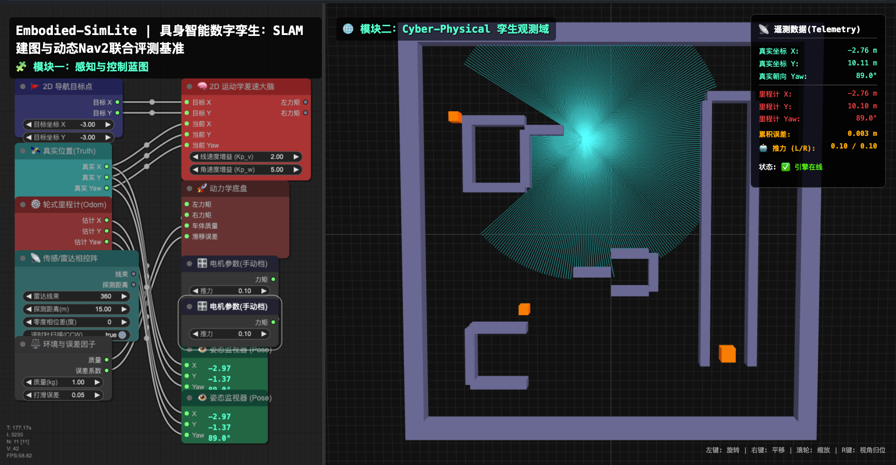
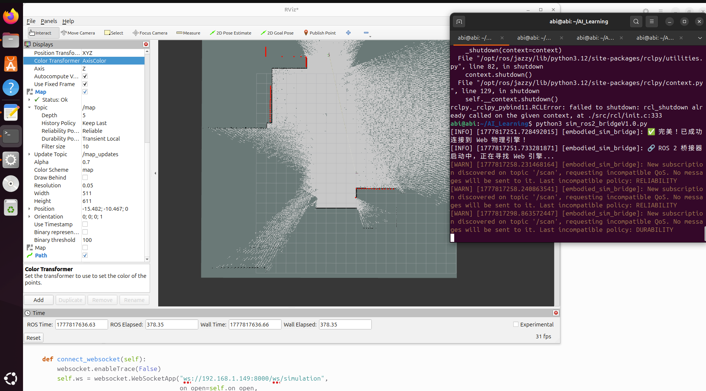

# 🚀 Embodied-SimLite

> **具身智能数字孪生：SLAM建图与动态Nav2联合评测基准**
> 
> *本项目旨在解决高校机器人/具身智能教学中，【Ubuntu + ROS 2 + Gazebo仿真】带来的硬件门槛高、易死机，以及底层算法呈现黑盒化的痛点。*

## ✨ 核心特性 (Key Features)

*   🌐 **纯 Web 端零部署 (Zero-Deployment)**：无需笨重的 Gazebo物理引擎，仅需浏览器即可体验 60Hz 的高保真数字孪生环境。
*   ⚖️ **1:1 动力学配平 (Kinematic-Dynamic Alignment)**：底层引擎内置 AABB 绝对刚体碰撞锁死与主动电机制动，实现物理积分稳态速度与 Nav2 下发的 DWB 运动学指令完美咬合，告别越界冲刺。
*   ⏱️ **工业级时空对齐 (Spatio-Temporal Synchronization)**：采用严格的时间戳令牌（Lidar Stamp）与 10Hz 限流拦截机制，消灭浏览器休眠引发的“位姿图撕裂 (Pose Graph Tearing)” Bug。
*   ⚔️ **40x40 六维复合极限压测场 (Benchmark Arena)**：内置长廊退化区、闭环迷宫、U型死锁谷、极窄一线天等经典压测地形。
*   🏃‍♂️ **多智能体动态博弈 (Multi-Agent Dynamic Obstacles)**：全域注入具有物理刚体阻挡效应的“高速巡逻车”，为 Nav2 的局部规划器（TEB/DWA）提供严苛的动态避让与重规划考场。

## 🛠️ 技术栈与环境要求 (Tech Stack & Env)

*   **智能体生成**：DeepSeek 大语言模型 (全栈结对编程生成)
*   **前端渲染层**：Three.js (3D 孪生) + LiteGraph.js (节点蓝图控制) + Web Workers (免疫休眠机制)
*   **后端计算层**：Python FastAPI + Uvicorn + Websockets
*   **中枢桥接层**：ROS 2 Jazzy + `rclpy` (动态 TF 广播与 SensorData QoS)
*   🐧 **调测验证环境**：**Ubuntu 24.04 + ROS 2 Jazzy** (核心桥接节点已在此环境下深度调测通过，向下兼容 Humble/Iron)

## 📖 极简运行指南 (Quick Start)

仅需两步，即可在本地唤醒这台工业级评测基准：

### Step 1: 启动物理与孪生引擎 (Server)
在任意安装了 Python 的终端执行：
```bash
pip install fastapi uvicorn websockets
python Product1.0.py

```
启动后，在浏览器访问 http://localhost:8000 即可进入孪生控制台。

### Step 2: 唤醒 ROS 2 通信桥接 (ROS 2 Bridge)
在配置了 ROS 2 Jazzy 的环境中执行：
```bash
python3 sim_ros2_bridgeV1.0.py

```
桥接器启动后，将自动监听 /cmd_vel 与 /cmd_vel_nav 指令，并向 ROS 2 环境高频广播 /odom、/scan 以及动态 /tf 坐标树。

## ⚙️ 调测与避坑指南 (Configuration & Troubleshooting)

为了确保仿真环境与 ROS 2 工业级算法的完美咬合，请在运行前务必阅读以下配置：

1. ⚠️ IP 地址与局域网配置 (Network Setup)
在运行 sim_ros2_bridgeV1.0.py 之前，请务必用编辑器打开该脚本，找到连接 Web 引擎的代码行（约第 46 行）：
```
self.ws = websocket.WebSocketApp("ws://192.168.1.149:8000/ws/simulation", ...)

```
必须将 192.168.1.149 修改为您运行 Product1.0.py 服务端的实际物理机 IP 地址。
注：建议在同一个局域网 (LAN) 内进行跨设备测试，以保证 60Hz 物理引擎的毫秒级时空同步。如果在同一台机器上运行，请修改为 ws://127.0.0.1:8000/ws/simulation。

2. 👁️ RViz2 孪生观测核心配置 (RViz2 Setup)
由于系统为了防卡顿采用了高频传感器数据推送，进入 RViz2 后，请按照以下参数进行配置，否则可能无法观测到数据：

- Global Options: 将 Fixed Frame 设置为 map（如果在建图前仅测试里程计，可暂设为 odom）。

- LaserScan (激光雷达点云):

    - QoS 设置（极其重要）: 展开 Topic 选项，将 Reliability Policy 必须修改为 Best Effort，将 Durability Policy 修改为 Volatile。（否则 RViz2 会直接丢弃桥接器发来的数据）。

    - Color Transformer: 建议设置为 FlatColor，并将 Color 调整为明亮的青色（Cyan）或红色，以便在复杂地形中清晰辨认打在墙体和动态障碍物上的光束。

- Map (全局代价地图): 点击 Add 添加 Map 组件，订阅 Nav2 的 /global_costmap/costmap 话题，观测系统生成的膨胀层。

- Path (全局与局部路径): 点击 Add 添加 Path 组件，分别订阅 /plan (全局规划 A* 路径) 和 /local_plan (TEB/DWA 局部弹性避障路径)，观测小车面对动态巡逻车时的绕行博弈策略。

3. 🖥️ 浏览器硬件加速 (Browser Hardware Acceleration)
系统前端包含 40x40 尺度的 3D 渲染引擎。请务必确保您的浏览器开启了“使用图形加速”（设置 -> 系统 -> 使用图形加速），否则可能导致浏览器单线程卡死，进而影响 Web Worker 向后端的雷达测距发包。

4. 🌳 坐标系断层排查 (TF Tree Check)
如果小车在 RViz2 中“乱飞”或报错找不到 base_link，请在终端运行以下命令验证 TF 树是否完整：
```bash
ros2 run tf2_tools view_frames

```
正常情况下，应呈现完美的单向流动链条：odom -> base_footprint -> base_link -> laser_frame。

## 🤖 AI 赋能声明 (AI Empowerment)
本项目的核心架构（包括 B/S 通信链路、Three.js 坐标系转换、全域 AABB 碰撞检测算法等）是在 DeepSeek 大模型 的全链条赋能下完成的。AI 的介入不仅将数百小时的底层代码敲击缩短至数日，更成功跨越了跨学科底层物理引擎开发的专业鸿沟。

